# Adapt Authoring Tool — Architecture

## System Architecture

```mermaid
flowchart TB
    subgraph Client["Client Layer"]
        UI["Backbone.js UI · 18 pluggable modules · Rollup · Babel · Handlebars · LESS"]
    end

    subgraph Server["Server & API Layer"]
        direction LR
        express["Express.js 5.1 · Helmet · Compression · Body Parser · Rate Limiter"]
        apiCore["REST API · JSON Schema Validation (AJV)"]
        corefw["Core Framework · App Singleton · AbstractModule · DependencyLoader · Hook System"]
        express -- "routes" --> apiCore -- "loads" --> corefw
    end

    subgraph Services["Service Modules"]
        direction LR
        subgraph AuthGroup["Authentication & Authorization"]
            direction TB
            auth["Auth"]
            authLocal["Auth Local (bcrypt)"]
            jwt["JWT Tokens"]
            sessions["Sessions"]
            roles["Roles (RBAC)"]
            users["Users"]
            usergroups["User Groups"]
            auth ~~~ authLocal ~~~ jwt ~~~ sessions ~~~ roles ~~~ users ~~~ usergroups
        end
        subgraph ContentGroup["Content & Authoring"]
            direction TB
            content["Content"]
            authored["Authored"]
            tags["Tags"]
            assets["Assets"]
            courseAssets["Course Assets"]
            courseTheme["Course Theme"]
            defaultPlugins["Default Plugins"]
            adaptFW["Adapt Framework"]
            content ~~~ authored ~~~ tags ~~~ assets ~~~ courseAssets ~~~ courseTheme ~~~ defaultPlugins ~~~ adaptFW
        end
        subgraph SupportGroup["Support Services"]
            direction TB
            config["Config"]
            logger["Logger"]
            mongoLogger["MongoDB Logger"]
            lang["Lang (i18n)"]
            langpack["Language Pack (EN)"]
            mailer["Mailer"]
            collab["Collab (WebSocket)"]
            errors["Errors"]
            config ~~~ logger ~~~ mongoLogger ~~~ lang ~~~ langpack ~~~ mailer ~~~ collab ~~~ errors
        end
    end

    subgraph Data["Data Layer"]
        direction LR
        mongodb[("MongoDB 7.0")]
        sessionStore[("Session Store")]
        logStore[("Log Store")]
    end

    Client -- "HTTP / REST" --> Server
    Server -- "validates & dispatches" --> Services
    Services -- "persists" --> Data

    classDef clientStyle fill:#4A90D9,stroke:#2C5F8A,color:#fff
    classDef serverStyle fill:#5BAE5B,stroke:#3A7A3A,color:#fff
    classDef serviceStyle fill:#E67E22,stroke:#BA6518,color:#fff
    classDef dataStyle fill:#3498DB,stroke:#2471A3,color:#fff

    class Client clientStyle
    class Server serverStyle
    class Services serviceStyle
    class Data dataStyle
```

## Module Dependency Hierarchy

```mermaid
flowchart TD
    core["core\n(App, AbstractModule,\nDependencyLoader, Hook)"]

    core --> config
    core --> logger
    core --> errors
    core --> server["server\n(Express.js)"]
    core --> mongodb["mongodb\n(Native Driver)"]

    server --> middleware["middleware\n(helmet, compression,\nbody-parser, rate-limiter)"]

    core --> jsonschema["jsonschema\n(AJV)"]
    core --> api["api\n(Abstract REST API)"]

    api --> auth
    api --> jsonschema
    api --> mongodb

    auth --> authLocal["auth-local\n(bcrypt)"]
    auth --> sessions["sessions\n(connect-mongo)"]
    auth --> roles
    auth --> users
    users --> usergroups

    core --> lang
    lang --> langpack["langpack-en"]

    core --> content
    content --> authored
    content --> tags
    content --> assets
    content --> courseAssets["courseassets\n(FFmpeg)"]
    content --> courseTheme["coursetheme"]
    content --> defaultPlugins["defaultplugins"]

    core --> adaptframework["adaptframework\n(adapt-cli)"]
    adaptframework --> contentPlugin["contentplugin"]
    adaptframework --> spoor["spoortracking\n(SCORM)"]
    adaptframework --> browserslist
    adaptframework --> zipper["_zipper\n(JSZip)"]

    core --> mailer["mailer\n(Nodemailer)"]
    core --> collab["collab\n(WebSocket)"]

    logger --> mongodblogger["mongodblogger"]
    mongodblogger --> mongodb

    sessions --> mongodb

    classDef coreNode fill:#9B59B6,stroke:#6C3483,color:#fff
    classDef infraNode fill:#5BAE5B,stroke:#3A7A3A,color:#fff
    classDef apiNode fill:#D4A843,stroke:#A07D2E,color:#fff
    classDef authNode fill:#E74C3C,stroke:#B03A2E,color:#fff
    classDef contentNode fill:#E67E22,stroke:#BA6518,color:#fff
    classDef adaptNode fill:#3498DB,stroke:#2471A3,color:#fff
    classDef supportNode fill:#1ABC9C,stroke:#148F77,color:#fff

    class core coreNode
    class config,logger,errors,server,middleware,mongodb infraNode
    class api,jsonschema apiNode
    class auth,authLocal,sessions,roles,users,usergroups authNode
    class content,authored,tags,assets,courseAssets,courseTheme,defaultPlugins contentNode
    class adaptframework,contentPlugin,spoor,browserslist,zipper adaptNode
    class lang,langpack,mailer,collab,mongodblogger supportNode
```

## Technology Stack

| Layer | Technologies |
|---|---|
| **Runtime** | Node.js 24, ES Modules |
| **Frontend** | Backbone.js, jQuery, Underscore, Handlebars, LESS |
| **Frontend Build** | Rollup, Babel 7 |
| **Backend** | Express.js 5.1, custom module system |
| **Database** | MongoDB 7.0 (native driver) |
| **Auth** | bcryptjs, JWT, express-session, connect-mongo, RBAC |
| **Validation** | AJV (JSON Schema) |
| **Security** | Helmet, rate-limiter-flexible |
| **Media** | FFmpeg, FFprobe |
| **Email** | Nodemailer |
| **Real-time** | WebSocket (ws) |
| **i18n** | Custom lang module + language packs |
| **Logging** | Chalk (CLI), MongoDB (persistent) |
| **Packaging** | JSZip, adapt-cli |

## Key Architectural Patterns

- **Plugin-based modularity** — Every feature is a separate npm package extending `AbstractModule` from `core`
- **Singleton App** — `App.instance` bootstraps and manages all modules via `DependencyLoader`
- **Hook system** — Lifecycle hooks for module initialization, ready states, and extensibility
- **RBAC** — Role-based access control with scoped permissions per API route
- **Event-driven UI** — `Origin` singleton (Backbone.Events) acts as a global event bus in the frontend
- **Schema-validated APIs** — All REST endpoints validated against JSON schemas using AJV
